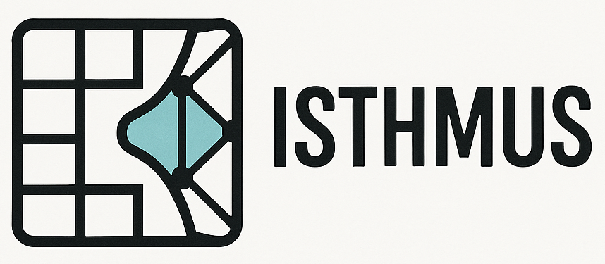

<p align="center">
  </img>
</p>

-----
# ISTHMUS: The marching windows between voxels and surface mesh

Isthmus is the **I**ntegrated **S**ystem for **T**hermochemical **H**eat transfer and **M**esoscale ablation of **U**nderlying **S**tructures, originally developed at University of Kentucky's [Computational Thermophysics and Fluids Laboratory](https://ctfl.engr.uky.edu/) (CFTL).

The program provides a bridge between voxelized geometries and their surface representations. While voxels and pixels are commonly used to approximate solid structures in imaging and simulations, voxelized surfaces fail to capture detailed geometry, creating challenges when modeling fluid flow around them. Isthmus introduces marching windows to generate accurate surface definitions for voxelized structures and consistently transfer fluxes between the surface mesh and voxels.

Isthmus is built for multiphysics simulations involving voxelized solids immersed in fluids, making it especially useful for problems such as fluid–structure interaction and thermochemical material response.

## Table of Contents
- [System Requirements](#system-requirements)
- [Installation](#installation)
    - [Step 1: build environment](#step-1-build-environment)
        - [Install conda](#install-conda)
        - [Create the Conda environment](#create-the-conda-environment)
        - [Activate environment](#activate-environment)
    - [Step 2: build marching cubes package](#step-2-build-marching-cubes-package)
    - [Step 3: Add Isthmus to `PYTHONPATH`](#step-3-add-isthmus-to-pythonpath)
    - [Step 4: using GPU acceleration with Numba (optional)](#step-4-using-gpu-acceleration-with-numba-optional)
        - [Set up CUDA Python](#set-up-cuda-python)
        - [Test Numba installation](#test-numba-installation)
- [Isthmus test](#isthmus-test)


## System Requirements

- Memory needs scale with voxel grid size.
- Optional GPU (Numba CUDA):
    - NVIDIA GPU + driver compatible with the selected CUDA runtime
    - Numba/llvmlite pair (e.g., Numba ~0.55.1 with llvmlite ~0.38.0)

## Installation

### Step 1: build environment
#### Install conda
To work with Isthmus, using `conda` is higly recommended to leapforg the packages dependency headache. To test whether it is installed, run `conda --version` from terminal to check the current version. If not, conda can be installed by following the instructions 
[here](https://docs.anaconda.com/anaconda/install/index.html). 

> **Note:** Using HPC, load conda module using your administrator guidelines, for example, in LCC (Lipscomb Compute Cluster) use: 
> ```bash
> module load ccs/anaconda/3
> ```

#### Create the Conda environment:
Create environment in conda default location using:
```bash
conda env create -n <your_env_name> -f envs/environment.yml
# or in custom location using:
conda env create -p </path/to/your_env_name> -f envs/environment.yml
```
> **Note:** Several Conda environment YAML files are located in the `envs` folder. Use `environment.yml` for complete environment to build Isthmus and utilize GPU acceleration using `Numba` and `CUDA`. Other environment files are listed in below table.
> 
> | Environment File | Description |
> |------------------|-------------|
> | `environment.yml` | Complete environment that contains cudatoolkit, numba, cython, and marching cubes dependencies. |
> | `environment_LCC.yml` | Build for LCC (Lipscomb Compute Cluster), without driver and cudatoolkit. Use `module load ccs/cuda/12.2.0_535.54.03` instead. |
> | `environment_wout_gpu.yml` | Environment with only cython and marching cubes dependencies. Does not run with GPU acceleration. |

#### Activate environment:

```bash
conda activate <your_env_name>
# or 
conda activate </path/to/your_env_name>
```

### Step 2: build marching cubes package
ISTHMUS package includes an open source build of marching cubes which must be compiled before moving forward. It needs these modules: `trimesh`, `lazy_loader`, `numpy`, `cython`, and `scipy`. They should be loaded within any conda environment defined in the above table. To compile, run the following from `src` directroy (Ignore the warnings).
```bash
python -W ignore setup.py build_ext --inplace
```

### Step 3: Add Isthmus to `PYTHONPATH`
At the end of your `.bashrc`, add the path to `isthmus/src/` to your `PYTHONPATH` environment variable.
```bash
export PYTHONPATH="/path/to/isthmus/src:$PYTHONPATH"
```

### Step 4: using GPU acceleration with Numba (optional)
Numba is a python compiler of python code for excution on CUDA-capable GPUs.
#### Set up CUDA Python
* Starting from scratch, CUDA python enviroment can be installed by following the instructions 
[here](https://developer.nvidia.com/how-to-cuda-python), 

Or

* Simply by loading the complete environment `environment.yml` contains cudatoolkit, numba, cython, and marching cubes dependencies.

Or

* If using the UKY LCC (University of Kentucky Lipscomb Compute Cluster). Use `environment_LCC.yml` and load the cuda module using, 
    ```bash
    module load ccs/cuda/12.2.0_535.54.03
    ```

    >  **Note:** Using HPC, you might get out of storage quota. It is recommended to clean old tarballs and caches using `conda clean -a`. If still not working, consider relocating the conda pkgs directory from your $HOME to your #SCRATCH folder (for higher quota), before creating the environment. 
    > ```bash
    > conda config --add pkgs_dirs /your/custom/path
    > ``` 

#### Test Numba installation
Validate with `check_numba_cuda.sh` (lists GPUs and runs a tiny GPU kernel)
```bash
chmod +x check_numba_cuda.sh
./check_numba_cuda.sh
```
You should recieve a message contains `All checks passed ✅` at the end. 


## Isthmus test
To confirm everything is working as expected, change directory to the `tests/` folder and type
```bash
pytest -v
```
You should recieve a message indicating that all tests have passed and no errors. If did not install CUDA Python environment, you will see the gpu tests skipped, which is fine.

---------

<!-- Source Files (./src)
--------------------
This is where the main body of the marching cubes is performed,
and where the pre-compilation of the cython parts are done

Testing Files (./testing)
-------------------------
This is where the testing script is to verify things like
geometry validity, quality, etc. -->

