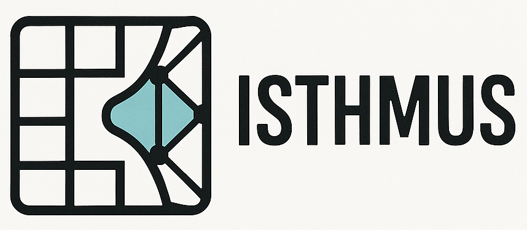

<p align="center">
  </img>
</p>

-----
# ISTHMUS: **I**nterfacing **S**urface **T**riangles and voxels for **H**eterogenous **MU**ltiphysics **S**imulations
ISTHMUS, originally developed at the [Computational Thermophysics and Fluids Laboratory](https://ctfl.engr.uky.edu/) (CFTL) of University of Kentucky, provides a bridge between voxelized geometries and their surface representations. While voxels and pixels are commonly used to approximate solid structures in imaging and simulations, voxelized surfaces fail to capture curved interfaces, creating challenges when modeling fluid flow around them. Isthmus introduces **Marching Windows**, a method to generate accurate surface definitions for voxelized structures and consistently transfer fluxes between the surface mesh and voxels.

This repository root now contains the native C++ implementation of ISTHMUS. The C++ library is intended to provide a reusable native interface for downstream solvers while preserving the marching-windows behavior that ISTHMUS relies on.

For examples of the capabilities of ISTHMUS, see the native demos located in the [`examples/`](examples/) directory.
The technical details of the algorithm implemented in ISTHMUS are presented in [this](https://arxiv.org/abs/2603.07396) ArXiv document.

## License

This software is licensed under the MIT License (see [`LICENSE`](LICENSE) file).
Please also see [`third-party-licenses/`](third-party-licenses/) for licensing information on bundled dependencies.

## Table of Contents
- [System Requirements](#system-requirements)
- [Installation](#installation)
    - [Step 1: configure the native build](#step-1-configure-the-native-build)
    - [Step 2: build ISTHMUS](#step-2-build-isthmus)
    - [Step 3: run the native tests](#step-3-run-the-native-tests)
    - [Step 4: use standalone examples](#step-4-use-standalone-examples)
- [ISTHMUS test](#isthmus-test)
- [Citing ISTHMUS](#citing-isthmus)

## More
* Feature requests and bugs can be raised on the [Github issue tracker](https://github.com/ctfl-public/isthmus/issues)
* [Marching windows theory](doc/theory.md)
* [Technical paper](https://arxiv.org/abs/2603.07396) of the ISTHMUS algorithm
* [Examples](examples/README.md)
* [Verification cases](V_and_V/fluxMapping) (Python-based for now)
* [Python bindings](python/README.md)
* [Legacy Python version](legacy/README.md)

## System Requirements

- A C++20-capable compiler.
- CMake 3.22 or newer.
- Memory needs scale with voxel grid size.
- Optional:
    - GNU Make for the standalone example Makefiles.
    - A Linux-like environment if you want to follow the exact command examples below.

## Installation

The steps below cover the native C++ build. For the Python wrapper, including quick install, manual installation, and editable development installs, see [python/README.md](python/README.md).

### Step 1: configure the native build

Generate the build system by running:
```bash
cmake -S . -B build
```

This creates a build tree in `build/` and prepares the reusable `isthmus_cpp` library target together with its package metadata.

### Step 2: build ISTHMUS
Compile the library and its native test executable by running:
```bash
cmake --build build -j
```

This build produces:

- the library archive
- the test executable
- the generated CMake package files for downstream `find_package(isthmus_cpp)` consumers

### Step 3: run the native tests
Run the compiled C++ test suite using:
```bash
ctest --test-dir build --output-on-failure
```

This executes the lightweight native regression suite and prints detailed output for any failing test.

### Step 4: use standalone examples
The repository ships native standalone examples in the [`examples/`](examples/) directory.
These include:

- [`examples/corner_demo/`](examples/corner_demo/)
- [`examples/surface_export_demo/`](examples/surface_export_demo/)
- [`examples/ablation_single_phase/`](examples/ablation_single_phase/)

Each example can be built in one of two ways.

Build with CMake by pointing the example at the root build tree:
```bash
cmake -S examples/ablation_single_phase -B examples/ablation_single_phase/build -Disthmus_cpp_DIR="$PWD/build"
cmake --build examples/ablation_single_phase/build -j
```

Or build with the local GNU Make entrypoint:
```bash
make -C examples/ablation_single_phase
```

The local example `Makefile`s link against `build/libisthmus_cpp.a` by default.
Override `ISTHMUS_BUILD_DIR=/path/to/build` if your native library archive lives somewhere else.

## ISTHMUS test
To confirm everything is working as expected, configure and build the repository root, then run
```bash
ctest --test-dir build --output-on-failure
```
You should receive a message indicating that all native tests have passed and no errors were found.

---------

## Citing ISTHMUS

Please cite the following articles when mentioning ISTHMUS in your own papers.

* Huff et al. [A Consistent Interface Reconstruction and Coupling Method for Multiphysics Simulations.](https://arxiv.org/abs/2603.07396) *ArXiv* 2026.
* Yassin et al. [ISTHMUS: Interfacing Surface Triangles and voxels for Heterogeneous MUltiphysics Simulations.](https://www.sciencedirect.com/science/article/pii/S2352711026001536) *SoftwareX* 2026.

**Bibtex**
```bibtex
@article{huff2026consistent,
  title   = {A Consistent Interface Reconstruction and Coupling Method for Multiphysics Simulations},
  author  = {Huff, Ethan and Poovathingal, Savio J.},
  journal = {arXiv preprint},
  year    = {2026},
  doi     = {10.48550/arXiv.2603.07396},
  archivePrefix = {arXiv},
  primaryClass  = {physics.flu-dyn}
}
@article{yassin2026isthmus,
  title   = {ISTHMUS: Interfacing Surface Triangles and voxels for Heterogeneous MUltiphysics Simulations},
  author  = {Yassin, Ahmed H. and Huff, Ethan H. and Mohan Ramu, Vijay B. and Tacchi, Bruno and Am\`erico, Carlos E. and Stoffel, Tyler D. and Poovathingal, Savio J.},
  journal = {SoftwareX},
  volume  = {34},
  number  = {102660},
  doi     = {10.1016/j.softx.2026.102660},
  year    = {2026}
  }
```
