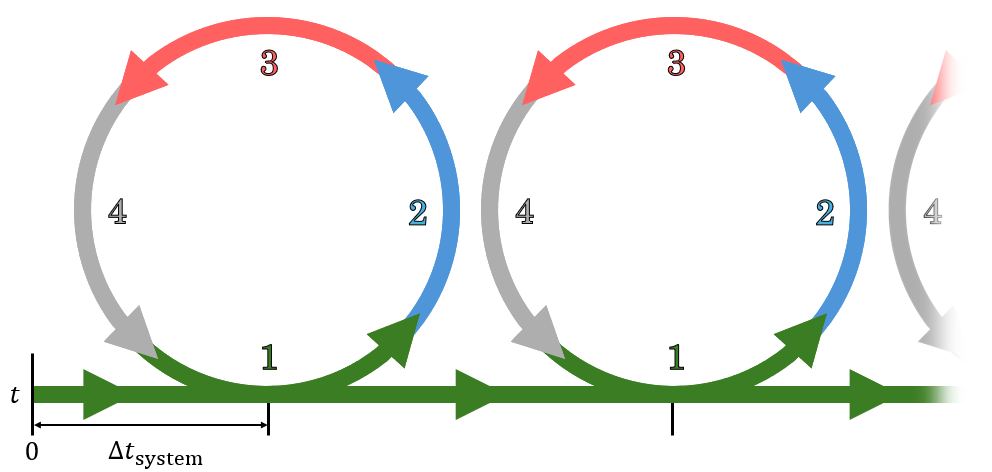
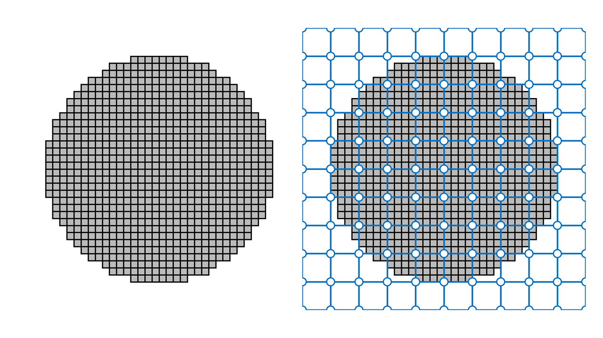
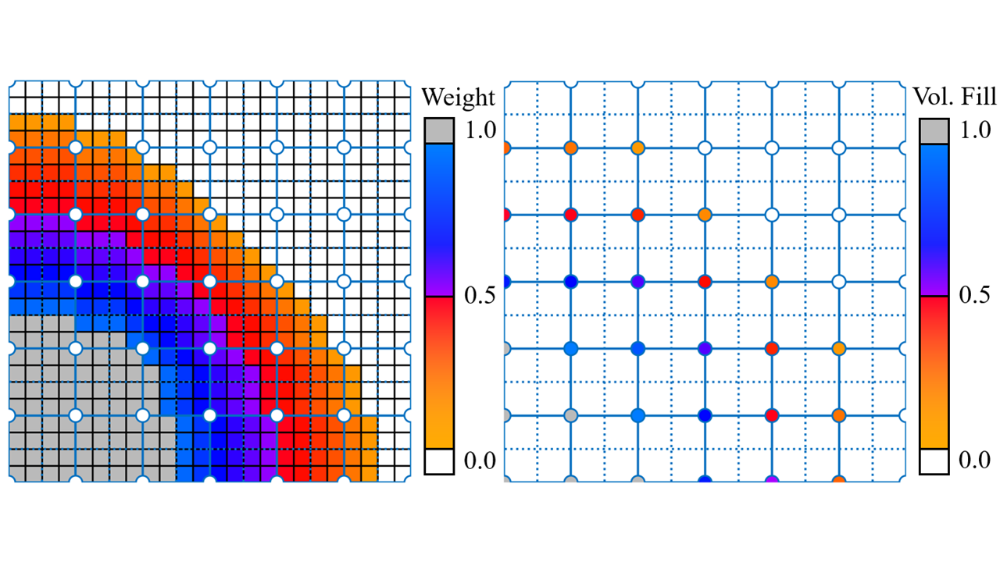
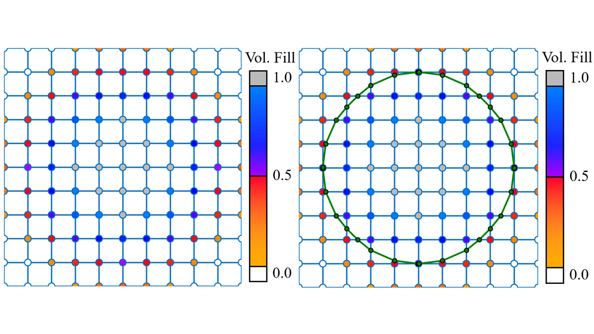
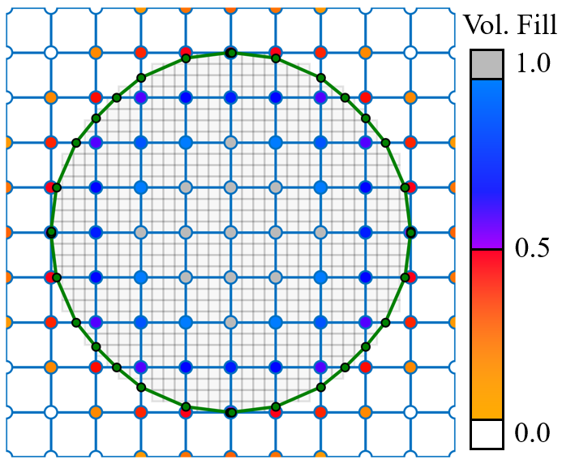
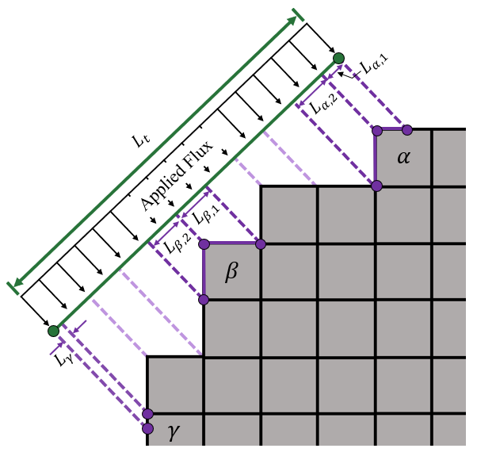

# Marching Windows

## System Description
ISTHMUS is a coupling program that implements the Marching windows coupling procedure in both 2D and 3D. Marching windows is a two-way coupling method designed to connect immersed-style simulations with voxel-based simulations. For clarity, the former class of simulations is referred to as "fluid" and the latter as "solid" simulations, although these are not strict constraints on the use of marching windows. Candidates for fluid simulations are those that accept a bounding surface consisting of a closed mesh of triangles in 3D (a closed mesh of lines in 2D). Solid simulation candidates are those whose unit geometries can be represented with uniformly sized voxel elements. In this document, *voxel* can refer to both 3D cubic elements and 2D square elements (also known as *pixels*).

Marching windows mediates between the coupled simulations by an interface surface. This surface is generated by marching windows estimating the outer boundary of the voxel structure in the solid simulation, and the resulting surface is placed into the fluid simulation as a boundary. The creation of this surface is termed *motion mapping*. If the voxel structure changes as a result of the solid simulation (deformation, phase change, etc.), marching windows can be used again to generate an updated surface as needed.

Conversely, the fluid simulation also transfers its coupling data via the surface. Any *fluxes* that are applied to the surface as a result of fluid simulation (heat, force, etc.) can be used to calculate a boundary condition for the solid simulation through marching windows. That is, triangle-based fluxes can be converted to voxel-based quantities using the *flux mapping* of marching windows.

The above diagram illustrates the coupled cycle in which marching windows can be used. During a single coupled system timestep, (1) a surface is generated from the current voxel structure, (2) the new surface is used to in the fluid simulation, (3) fluxes from the surface are mapped to voxels, and (4) the mapped voxel fluxes are used as boundary conditions for the solid simulation. For strongly coupled systems, this cycle can be repeated at the same timestep until convergence. Loosely coupled systems start the new system iteration without repeating the first. The motion mapping and flux mapping methods are described in sections below. Further details can be found in a paper[^1] [link pending] which explains marching windows and tests it on some basic geometries.

## Motion Mapping

The motion mapping procedure in marching windows converts a voxel structure into an outer surface composed of triangles (or lines). The explanation and illustration below describe the process in 2D for clarity, but the 3D process is analogous.

Marching windows begins with a pre-existing voxel structure, illustrated below by the low-resolution gray circle. The heart of motion mapping in marching windows is the marching squares procedure.[^2] Marching squares estimates isosurfaces on a cubic Cartesian grid which has a scalar value defined at each corner, or node. In marching windows, the node's scalar value is defined by the fraction of filled area (volume in 3D) in the neighborhood of the node. If voxels completely fill the neighborhood, the scalar at the node is 100%. If there are no voxels or portions of voxels in the neighborhood, the scalar is 0%. Marching squares is used later in the motion mapping procedure to estimate the 50% fill isosurface. The first step in marching windows is to define a grid overlaid on top of the voxel structure to establish grid nodes and their respective neighborhoods. The blue grid illustrated below marks nodes with white circles.

In 3D, voxels are cubic, and marching squares is replaced by marching cubes.[^3] The only difference at this stage of motion mapping is that the voxel structure and overlaid grid both have cubic elements rather than square elements.

The 2D (or 3D) space within the grid is divided between nodes to create the neighborhoods. Each node owns all points in space which are closest to itself. These points in space are the neighborhood of the node. In a square Cartesian grid, this means that the neighborhood around each node is a square centered on the node, extending halfway to each surrounding node. The neighborhoods are illustrated below, where the neighborhoods are denoted by the square formed by dashed lines that is centered on each node. In 3D, the neighborhoods are cubes rather than squares.

Two clarifying notes: First, the neighborhoods of nodes on the edge of the grid do contain space outside of the grid, and they have the same shape and size of neighborhood as internal nodes. Second, the definition of neighborhoods given above ambiguously defines points on the boundaries between neighborhoods. However, this is not relevant for the creation of the final surface, as that is dependent on *area* fill fraction (volume in 3D). The boundaries have zero depth and therefore would contribute zero area (or volume) to fill fraction calculations.

At this point in the process, fill fractions can be calculated for each node. In this example, it would be the fraction of space in each square neighborhood which is gray. More formally, fill fraction can be expressed as a ratio of filled area ($A_{\text{fill},\mu}$) of node $\mu$ and total node area ($A_{\mu}$). Total node area is always $A_{\mu} = L_c^2$, where $L_c$ is the side length of a grid cell. For each node $\mu$, the fill fraction is calculated as 

$$ \frac{ A_{\text{fill},\mu} }{ A_{\mu} } = \frac{\sum_i^{n_{vox,\mu}} L_v^2}{L_c^2} $$

for $n_{\text{vox},\mu}$ voxels of side length $L_v$ contained in the neighborhood of $\mu$.

In this illustrated case, the voxel edges and neighborhood boundaries are aligned such that there are no voxels overlapping two different neighborhoods. In a more general case, voxels which overlap have their areas split between the neighborhoods, and for a neighborhood with $n_{vox,\mu}$ voxels at least partially inside of it,

$$ \frac{ A_{\text{fill},\mu} }{ A_{\mu} } = \frac{\sum_i^{n_{\text{vox},\mu}} f_{i,\mu} L_v^2}{L_c^2} $$

where $f_{i,\mu}$ is the fraction of the area of voxel $i$ which overlaps the neighborhood of node $\mu$.

For reasons explained in the marching windows paper,[^1] the naive area fill calculation explained above can be improved for certain scenarios by weighting each voxel according to how deeply it is placed within the structure. Each voxel is assigned an integer depth ($d_v$) to quantify depth. Boundary voxels, defined as voxels which have at least one side exposed to empty space, have depth $d_v=0$. All other voxels have depths calculated by counting the minimum number of steps required to reach a boundary voxel, only taking steps from one voxel to another sharing an edge. This counting is equivalent to counting the number of squares a chess rook would need to cross from its current position to a desired position. Additionally, empty spaces near the structure boundary are treated as pseudo-voxels, or *ghost voxels*. The depth of ghost voxels are calculated in the same manner, except that the depths are counted down from zero to negative numbers. For example, the first empty space near a boundary voxel has a depth of -1, the next has a depth of -2, etc. For all true voxels and ghost voxels, weights ($w_v$) are calculated as

$$ w_v = \frac{1}{2} + \frac{ (\frac{1}{2} + d_v) L_v}{3L_c} $$

Any weights which fall outside the range $0 \leq w_v \leq 1$ are clipped to be within it. The weights for the circle example are shown in the figure below. Different color gradients are used to distinguish between true and ghost voxels, though both are treated the same in area fill calculations. Note the clipping of weights to 1 and 0 in the deep structure and the far void, respectively. With weighting applied, node fill fractions are calculated as

$$ \frac{ A_{\text{fill},\mu} }{ A_{\mu} } = \frac{\sum_i^{n_{\text{vox},\mu}} w_{i} f_{i,\mu} L_v^2}{L_c^2} $$

Calculating weights and fill fractions is very similar in 3D. For unweighted calculations with voxels uniquely contained in neighborhoods, volume fill fraction is calculated as

$$ \frac{ V_{\text{fill},\mu} }{ V_{\mu} } = \frac{\sum_i^{n_{\text{vox},\mu}} L_v^3}{L_c^3} $$

If voxel volumes are split between different neighborhoods,

$$ \frac{ V_{\text{fill},\mu} }{ V_{\mu} } = \frac{\sum_i^{n_{\text{vox},\mu}} f_{i,\mu} L_v^3}{L_c^3} $$

where $f_{i,\mu}$ is the fraction of the volume of voxel $i$ which overlaps the neighborhood of node $\mu$.

As in 2D, voxel depth for weighting is $d_v = 0$ for boundary voxels, here defined as those which have at least one of its *cubic faces* exposed to empty space. Counting depth for interior voxels and ghost voxels is the same as in 2D, except that instead of stepping from one voxel to another sharing an *edge*, steps are taken from one to another sharing a *cubic face*. After voxel depth is calculated, weight is calculated with the same formula as in 2D and is clipped to the same [0,1] range. Fill fraction is calculated with weighting as

$$ \frac{ V_{\text{fill},\mu} }{ V_{\mu} } = \frac{\sum_i^{n_{\text{vox},\mu}} w_{i} f_{i,\mu} L_v^3}{L_c^3} $$

The second image in the figure below shows the area fill after the weighted fill calculation in 2D.

Once scalar values have been calculated for each node, marching squares can estimate an isosurface, the 50% fill surface, from the grid. The figure (zoomed back from the quarter-circle out to the whole grid) below shows the surface generation from the scalar-filled grid. The surface is a connected series of line segments whose endpoints fall on gridlines. For any grid squares that have at least one node with >50% fill and at least one node with <50% fill, marching squares draws a line(s) that separates them. The line endpoints are linearly interpolated between the separated nodes to fall on the 50% fill point. In 3D, the marching cubes procedure is very similar, except that it creates 3D surfaces from triangular elements. The triangular elements function the same way as the line elements, separating >50% fill nodes from <50% fill nodes in each grid cell.

The figure below compares the original voxel structure to the node fill fractions and the final surface. Note that even with a relatively low-resolution grid, the shape and size of the original voxel structure is well-matched by the generated surface.

One benefit of the above motion mapping procedure is that the resolution of the original voxel structure can be different from the resolution of the surface. The step that converts voxels into nodal fill fractions allows the two resolutions to be independent of one another. For voxelized scans of material samples, the voxel size can be set to the resolution of the scan. For simulations using voxel or voxel-like structures (e.g. thermal conduction, structural response), the voxel size can be set to the necessary size to achieve an accurate result. Convergence studies can be performed where voxel size is varied to achieve independence of discretization. Surface resolution is effectively determined by grid cell size, as all surface elements in marching squares (cubes) are linear (planar) within a cell and terminate at the cell boundaries. Rather than being tied to the voxel size, grid resolution can be set to capture relevant surface features (e.g. divots, protuberances, curvature). Sharp features are more likely than curved features to be missed, but this is an inherent behavior of marching squares/cubes. Features below the scale of a grid cell are always at risk of not being captured. Despite this, feature capture errors can be mitigated with the use of smaller grid cells, and modifying the grid resolution will not affect the voxel structure. Additionally, neither the grid resolution nor the voxel resolution is tied to an underlying simulation mesh from another simulation program. While marching windows can be used to generate surfaces for placement in fluid simulations, the mesh of that underlying simulation is irrelevant to the motion mapping (and flux mapping) of marching windows. Regardless of the mesh style or resolution of the fluid simulation, an independent grid and independent voxel structure can be specified for marching windows.

(NOTE: while in theory, voxel and grid resolutions are completely independent, ISTHMUS in its current form will not accept grid cell sizes smaller than a voxel for algorithmic reasons. While this could be changed, there is a point of diminishing returns with using smaller grid cells to achieve more refined surfaces. In theory, one could use grid cells much smaller than a voxel size, but this will capture the harsh $90\degree$ turns present on the outer surface of the original voxel structure. While this is technically a more accurate representation of the voxel structure than a more rounded, smooth surface, the roughness that a hyper-accurate surface introduces likely is not what most users will desire.)

## Flux Mapping

During the course of a fluid simulation, often the resulting surface quantities such as heating rates and mechanical loads are relevant to the overall system, e.g. aerodynamic heating rates are important for characterizing solid material response to high-speed flow. In a coupled simulation that uses marching windows, the surface quantities calculated for 2D line elements (or 3D triangle elements) need to be transferred to the voxel structure to act as a boundary condition. The mapping of fluxes in marching windows is modeled somewhat like sunlight (the flux) coming through a window (the surface element) parallel to its normal vector and striking objects inside (the voxels). 

The process is illustrated in the figure below. The green surface element has some flux applied to it, which could be heat, pressure, mass flux, etc. It is assumed that any flux is applied evenly across the whole surface element. The goal of the flux mapping of marching windows is to conserve the total of any transferred surface quantities when mapped to voxel form, so the flux should ideally be expressed in terms of conserved variables. For example, if heat flux (power per unit area) is being transferred, it should be converted to total heating rate (power) before mapping to voxels to ensure conservation of energy. This conserved scalar variable (or just *scalar*) for each surface element is denoted as $F_t$.

In order to determine which voxels receive surface fluxes from each surface, voxels near to the surface are checked to see if their exposed faces are visible to the surface element. Each exposed face ($f$) of each voxel ($v$) is first checked to see if it is aligned with the surface element ($t$) by comparing outward normal vectors,

$$ \vec{n}_{f,v} \cdot \vec{n}_t > 0 $$

If this condition is true, then the voxel face is a valid target to receive part of the surface scalar. If the condition is not true, then face $f$ is skipped, as it could be in a different but nearby part of the structure. That face is assumed to not be affected by surface element $t$. All valid faces are then projected onto the plane of the surface element of length $L_t$ to check for overlapping length. If there is overlap, then the voxel which owns the overlapping projected face will receive part of the surface scalar. For example, voxel $\beta$ in the figure below has two exposed faces, and when they are projected, both overlap fully with the surface element.

The surface scalar quantities are mapped to voxels proportionally to how much overlap there is between the surface element and the projected faces of each voxel. The length of the overlap region of the projected face $f$ and the surface element $t$ is denoted as $L_{\text{clip},f,t}$. The share of the surface scalar received by face $f$ from element $t$ is

$$ F_{f,v,t} = F_t \frac{L_{\text{clip},f,t}}{\sum_i^{n_{f,t}} L_{\text{clip},i,t}} $$

where $n_{f,t}$ is the total number of faces with projected overlap on element $t$. The total scalar quantity received by each voxel ($F_v$) is the sum of the scalar quantities received by its $n_{f,v}$ exposed faces from all $n_\text{surf}$ surface elements,

$$ F_{v} = \sum_t^{n_\text{surf}} \sum_f^{n_{f,v}} F_{f,v,t} $$

The total scalar quantity applied to voxel $\alpha$ in the figure above will be calculated as an example. Voxel $\alpha$ has two exposed faces that overlap element $t$ after projection, and their overlap lengths are denoted as $L_{\alpha,1}$ and $L_{\alpha,2}$. Element $t$ is the only surface element in this (fictionalized) system. Therefore, the total scalar quantity received by voxel $\alpha$ is

$$ F_{\alpha} = \sum_t^{1} \sum_f^{2} F_{f,\alpha,t} = F_t \frac{L_{\alpha,1} + L_{\alpha,2}}{\sum_i^{n_{f,t}} L_{\text{clip},i,t}} $$

In this simple case, the entirety of element $t$ is overlapped by projected voxel elements with no areas double-overlapped, so $\sum_i^{n_{f,t}} L_{\text{clip},i,t} = L_t$. Therefore,

$$ F_{\alpha} = F_t \frac{L_{\alpha,1} + L_{\alpha,2}}{L_t} $$

In 3D, the same principles are followed to transfer fluxes from surface triangles to voxels, but projected area of square voxel faces is used as the proportionality factor instead of projected length of line voxel edges. The process begins in the same way by checking alignment of outward normals for surface triangles and nearby exposed voxel faces. Following this check, aligned voxel faces are projected onto the surface triangle plane, and overlap area ($A_{\text{clip},f,t}$) is calculated. If there is area overlap, the scalar transfer from triangle to voxel face is

$$ F_{f,v,t} = F_t \frac{A_{\text{clip},f,t}}{\sum_i^{n_{f,t}} A_{\text{clip},i,t}} $$

and the total scalar quantity transferred to the voxel is summed the same way as in 2D.

Note, vector quantities are transferred in the same way as scalar quantities. Each component of the vector is treated as any other scalar quantity.

## Conservation

A primary benefit of the flux mapping employed by marching windows is that with good-quality grids and surfaces, the total scalar quantity summed across all triangles is conserved when mapped to voxel quantities. The scalar sum across all triangles is

$$ F_{t,\text{sum}} = \sum_t^{n_\text{surf}} F_t $$

while the scalar sum across all $n_{\text{vox}}$ voxels post-mapping is

$$ F_{v,\text{sum}} = \sum_v^{n_\text{vox}} F_v $$

Then, using the mapping relationships from above,

$$ F_{v,\text{sum}} = \sum_v^{n_\text{vox}} \Biggl(\sum_t^{n_\text{surf}} \sum_f^{n_{f,v}} F_{f,v,t} \Biggr) = \sum_v^{n_\text{vox}} \Biggl(\sum_t^{n_\text{surf}} \sum_f^{n_{f,v}} F_t \frac{L_{\text{clip},f,t}}{\sum_i^{n_{f,t}} L_{\text{clip},i,t}} \Biggr)  $$

Rearranging,

$$ F_{v,\text{sum}} = \sum_t^{n_\text{surf}} \Biggl(\sum_v^{n_\text{vox}} \sum_f^{n_{f,v}} F_t \frac{L_{\text{clip},f,t}}{\sum_i^{n_{f,t}} L_{\text{clip},i,t}}\Biggr) = \sum_t^{n_\text{surf}} \frac{F_t}{\sum_i^{n_{f,t}} L_{\text{clip},i,t}} \Biggl(\sum_v^{n_\text{vox}} \sum_f^{n_{f,v}} L_{\text{clip},f,t}\Biggr) $$

Summing across all exposed faces ($\sum_i^{n_{f,t}}$) is equivalent to summing across all voxels and their exposed faces ($\sum_v^{n_\text{vox}} \sum_f^{n_{f,v}}$), therefore,

$$ F_{v,\text{sum}} = \sum_t^{n_\text{surf}} F_t \frac{\sum_i^{n_{f,t}} L_{\text{clip},i,t}}{\sum_i^{n_{f,t}} L_{\text{clip},i,t}} $$

As long as $\sum_i^{n_{f,t}} L_{\text{clip},i,t} > 0$,

$$ F_{v,\text{sum}} = \sum_t^{n_\text{surf}} F_t = F_{t,\text{sum}} $$

and total scalar quantity is conserved after mapping. The above explanation also applies in 3D, just replacing line overlaps ($L_{\text{clip},f,t}$) with area overlaps ($A_{\text{clip},f,t}$). Therefore, the flux mapping of marching windows does conserve scalar totals, *as long as no surface element is left without at least one overlapping projected voxel face*. If $\sum_i^{n_{f,t}} L_{\text{clip},i,t} = 0$, then the expression $\sum_i^{n_{f,t}} L_{\text{clip},i,t} / \sum_i^{n_{f,t}} L_{\text{clip},i,t}$ is undefined. Practically, any surface element unmatched to at least one voxel will not have its scalar value mapped to voxels. Therefore, the scalar sum across all voxels, given $n_{\text{surf},0}$ unmatched surface elements, will be

$$ F_{v,\text{sum}} = F_{t,\text{sum}} - \sum_t^{n_{\text{surf},0}} F_t  $$

[^1]: arXiv link pending

[^2]: Maple, C.: Geometric design and space planning using the marching squares and marching cube algorithms. In: 2003 International Conference on Geometric Modeling and Graphics, 2003. Proceedings, pp. 90–95 (2003). https://doi.org/10.1109/GMAG.2003.1219671

[^3]: Lorensen, W.E., Cline, H.E.: Marching cubes: A high resolution 3D surface construction algorithm. In: Proceedings of the 14th Annual Conference on Computer Graphics and Interactive Techniques. SIGGRAPH ’87, pp. 163–169. Association for Computing Machinery, New York, NY, USA (1987). https://doi.org/10.1145/37401.37422
