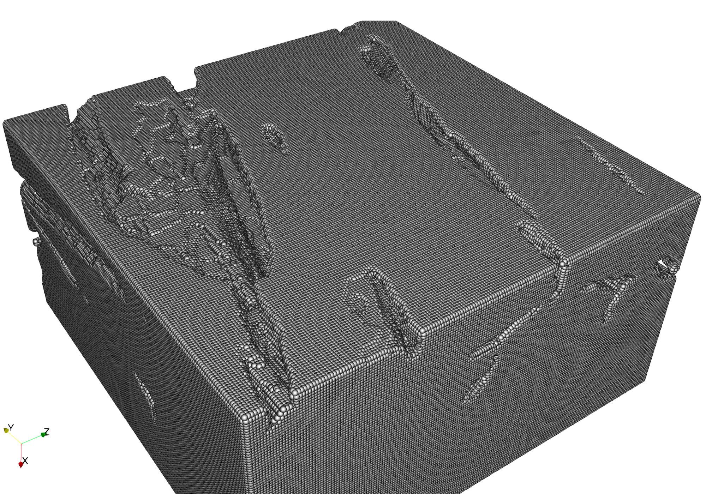
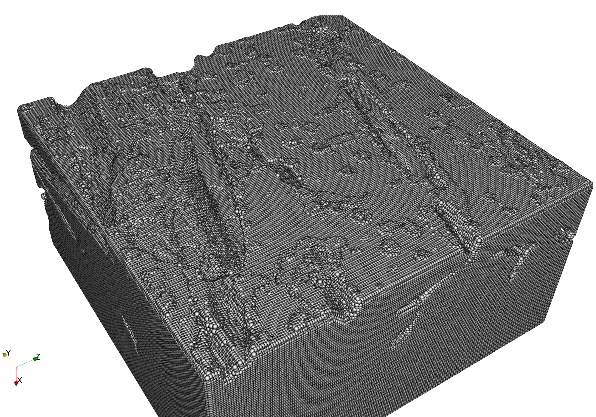
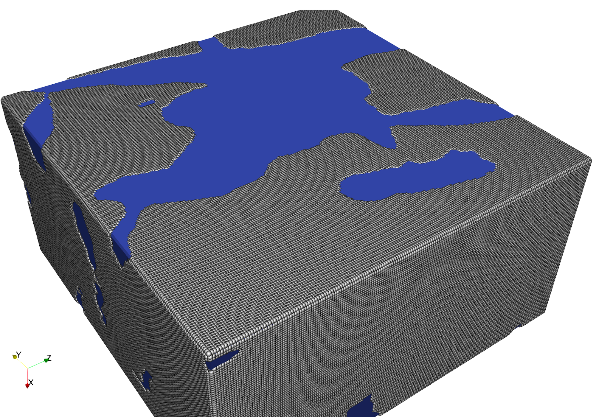
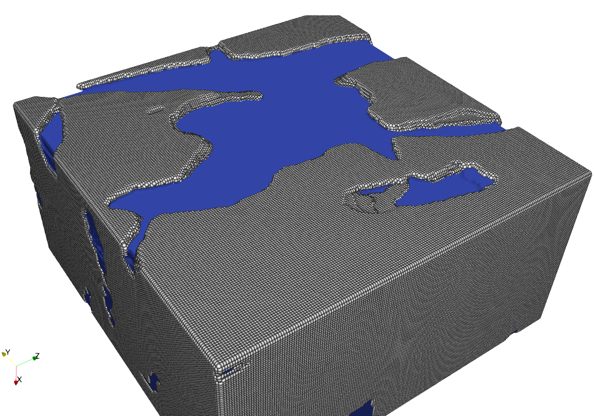

# Tutorial: Ablation of a Carbon material sample using ISTHMUS and DSMC

This tutorial guides you through the use of ISTHMUS to model the ablation of a carbon material sample when exposed to high temperature.
Gaseous interactions surrounding the material are handled by DSMC through SPARTA, while ISTHMUS recesses the material.
The recession rates computed based on DSMC are provided for you in the folder `reactionFiles`, so running DSMC is not required.

The material is a rectangular sample 100 $\times$ 200 $\times$ 200 voxels in size, where each voxel has a unit length of 3.376 microns, and is exposed to oxygen at 1500 K.
The oxygen is 95% monatomic O and 5% diatomic O$_2$ by mass. 
We will run two cases with the same scale, but slightly different samples capturing different phenomena.
- **Sample 1:** Ablation driven by microstructure defects.
Voxels are pure carbon, and remaining unoccupied space is air.
- **Sample 2:** An imitation of differential ablation where the scanned voxels are the composite carbon matrix and the remaining space is fiber.
We emphasize that the matrix component of this case does not resemble a realistic carbon/carbon composite material.

**Note:** It is recommended to run this example case using an HPC system, as the sample contains about 3.6 million voxels.
On a typical laptop or desktop machine, completion may take around 1-2 hours.

**Devs:** Note that this tutorial file `ablationExample.md` is tangled to the `.py` scripts required to run. 
To change those files, make your changes here and then tangle the markdown file by running `tangle.py`.

---

## Sample 1: Single Phase Ablation Driven by Microstructure Defects


To execute the script, run the Python script produced by this tutorial document:
``` sh
cd singlePhase
python3 singlePhase.py
```

### Case Setup

For this example, we define a single class `ablationCase` which contains the details specific to the sample analyzed.
The class is located in `utils.py`.

```python {file=singlePhase/utils.py}
import numpy as np
import trimesh
import os
import imageio
import warnings
import shutil
from isthmus import readVoxelTri
#
class ablationCase:
```

This file firstly contains the size of the sample in voxels, the unit size of each voxel in meters, and some parameters which were required to run DSMC.
The sample was originally extracted from a scanned specimen using a buffer layer of five voxels surrounding it. 

```python {file=singlePhase/utils.py}
    def __init__(self):
        #
        # .tif file of sample to be analyzed
        fileName = 'sample1.tif'
        #
        # Size of the sample
        width = 200
        height = 100
        buffer = 5
        voxelSize = 3.3757e-6
        #
        # Timescale and some quantities for DSMC
        self.couplingTime = 100
        self.timestepDSMC = 7.5e-9
        self.fnum = 14866.591116363918
        self.avog = 6.022*10**23
        self.molarMass = 18 
        #
        # Set up domain
        self.voxelSize = voxelSize
        lo = [-buffer, -buffer, -buffer]
        hi = [height + buffer, (width + buffer), (width + buffer)]
        self.lims = voxelSize*np.array([lo, hi])
        self.nCells = np.array([int(height),int(width),int(width)])
        #
        # Create required directories if they don't already exist
        dirs = ['grids','voxel_data','voxel_tri']
        for d in dirs:
            os.makedirs(d,exist_ok=True)
        print('Directories created')
        #
        # Load voxels from tiff file
        voxelMatrix = imageio.volread(fileName)
        voxs = []
        for i in range(int(width)):
            for j in range(int(width)):
                for k in range(int(height)):
                    if voxelMatrix[k,j,i] == 1:
                        voxs.append([k,j,i])
        self.voxs = np.array(voxs)*self.voxelSize
        print(f'{len(voxs):d} voxels loaded from sample')
        #
```

### Main Script

We now show the main script in `singlePhase.py`.
The script first runs isthmus' main routine `marchingWindows` to generate an initial surface mesh from the sample, including faces and vertices.
This is exported and saved as `grids/grid_0.stl`.
Then, the material recesses during seven steps in a loop.

```python {file=singlePhase/singlePhase.py} 
# If not added to the PYTHONPATH, uncomment bellow to add the ISTHMUS source directory.
# import sys
# sys.path.append('/path/to/isthmus/src/')
from isthmus import marchingWindows
print('ISTHMUS module loaded')
#
# Import custom case functions for this script
from utils import *
#
# Case initialization
case = ablationCase()
gpu = False
weight = False
nsteps = 3
#
# Initial step: Generate initial mesh
step = 0
print(f'Step {step:d}/{nsteps:d}')
#
# Run ISTHMUS on loaded voxels and parse volumes, faces, and vertices
resultsMC = marchingWindows(case.lims, case.nCells, case.voxelSize, case.voxs, 'vox2surf.surf', step,
                            weight=weight, gpu=gpu)
cornerVolumes = resultsMC.corner_volumes
faces = resultsMC.faces
vertices = resultsMC.verts
#
# Generate surface .stl file and volume fraction file
case.postProcess(cornerVolumes,vertices,faces,step)
#
# During remaining steps, ablate the material and update the grid
for step in range(1,nsteps+1):
    print(f'Step {step:d}/{nsteps:d}')
    #
    # Run DSMC
    case.runDSMC(step)
    #
    # Here the ablation is done and material ablates
    case.ablate(step)
    #
    # Run ISTHMUS on updated voxels for next iteration
    resultsMC = marchingWindows(case.lims, case.nCells, case.voxelSize, case.voxs, 'vox2surf.surf', step, 
                                weight=weight, gpu=gpu)
    cornerVolumes = resultsMC.corner_volumes
    faces = resultsMC.faces
    vertices = resultsMC.verts
    #
    # Post process results
    case.postProcess(cornerVolumes,vertices,faces,step)
#
# Remove temporary files
case.clean()
```

### Using Pre-generated DSMC Data to Determine Surface Reactions

the function `runDSMC` is a placeholder for a step at which DSMC could be run.
Instead, we read rates of CO formation from files `reactionFiles/surf_react_sparta_X.out`.

```python {file=singlePhase/utils.py}
    def runDSMC(self, step):
        """
        Runs DSMC simulation using SPARTA.
        """
        # Instead of running DSMC, we will read pre-calculated reaction files
        COFormed = self._readReactionSPARTA('reactionFiles/surf_react_sparta_'+str(step)+'.out')
        self.COFormed = COFormed[COFormed[:, 0].argsort()]
        #
```

### Ablating the Material

The function `ablate` recesses the material based on the mass of CO formed at each surface triangle.
During this step, a voxel is removed if its mass has been totally removed by the reaction.

```python {file=singlePhase/utils.py}
    def ablate(self, step):
        """
        Ablates the material based on the mass of CO formed at each surface triangle.
        Updates the voxel list by removing voxels that have completely ablated.
        """
        # read volume fraction of the material
        with open('volFrac.dat') as f:
            cVolFrac = f.readline().strip('\n')
        # 
        # Read voxel data 
        with open('voxel_data/voxel_data_'+str(step-1)+'.dat') as f: 
            lines = (line for line in f if not line.startswith('#')) 
            voxs_alt = np.loadtxt(lines, delimiter=',', skiprows=0) 
        # 
        # Associate voxels to tirangles (The flux mapping file)
        tri_voxs,tri_sfracs = readVoxelTri('voxel_tri/triangle_voxels_'+str(step-1)+'.dat')
        #
        #Triangles check between sparta and isthmus
        if len(self.COFormed) != len(tri_voxs):
            warnings.warn("No of triangles in sparta is not equal to isthmus, debug!!!")
        #
        # Calculate mass of carbon associated with each voxel
        volFracC = float(cVolFrac)
        volC = volFracC*(self.lims[1,0]-self.lims[0,0])*(self.lims[1,1]-self.lims[0,1])*(self.lims[1,2]-self.lims[0,2])
        massC = volC*self.molarMass*100
        massCVox = massC/len(voxs_alt)
        # 
        # Calculate the mass of carbon removed from each voxel
        cRemovedVox = np.zeros((len(voxs_alt)))
        for i in range(len(self.COFormed)):
            vox_no = np.array((tri_voxs[(i+1)]),dtype = int)
            sfracs = np.array((tri_sfracs[(i+1)]),dtype = float)
            for k in range(len(vox_no)):
                cRemovedVox[vox_no[k]] = cRemovedVox[vox_no[k]] + sfracs[k] * self.COFormed[i,1]
        cRemovedVox[:] = cRemovedVox[:] + voxs_alt[:,3]
        # 
        # Remove voxels
        voxs_alt = np.column_stack((voxs_alt[:,0:3],cRemovedVox))
        for i in range(len(cRemovedVox)):
            if cRemovedVox[i] > massCVox:
                voxs_alt[i,:] = 0
        self.voxs_alt = voxs_alt[~np.all(voxs_alt == 0, axis=1)] 
        self.voxs = self.voxs_alt[:,0:3]
        #
```

### Saving the Results

The main visual result is the ablated grids `grids/grid_X.stl` which is saved during a call to `postProcess`.

```python {file=singlePhase/utils.py}
    def postProcess(self, cornerVolumes, vertices, faces, iteration):
        """
        Writes an STL file 'grids/grid_:iteration:.stl'.
        Writes a voxel data file 'voxel_data/voxel_data_:iteration:.dat'.
        Writes a volume fraction file 'volFrac.dat'.
        """
        # Write the stl file
        combinedMesh = trimesh.Trimesh(vertices=vertices, faces=faces)
        combinedMesh.export('grids/grid_'+str(iteration)+'.stl', file_type='stl_ascii')
        #
        # Write coordinate voxel data
        if iteration == 0:
            cRemovedVox = np.zeros((len(self.voxs),1))
            self.voxs_alt = np.column_stack((self.voxs,cRemovedVox))
        f = open('voxel_data/voxel_data_'+str(iteration)+'.dat','w+')
        for i in range(len(self.voxs_alt)):
            f.write(str(self.voxs_alt[i,0])+','+str(self.voxs_alt[i,1])+','+str(self.voxs_alt[i,2])+','+str(self.voxs_alt[i,3])+'\n')
        f.close()
        #
        # Write the file containing volume fraction of the material
        cVolFrac = np.sum(cornerVolumes)/(self.nCells[0]*self.nCells[1]*self.nCells[2])
        f = open('volFrac.dat','w+')
        f.write(str(cVolFrac)+'\n')
        f.close()
        #
```

### Cleaning up Temporary Files

The files in the directory `voxel_tri` are automatically generated by `marchingWindows`, while the other directory and file here were used to save data between ablation steps.

```python {file=singlePhase/utils.py}
    def clean(self):
        #
        # Remove temporary files
        shutil.rmtree('voxel_data',ignore_errors=True)
        shutil.rmtree('voxel_tri',ignore_errors=True)
        os.remove('volFrac.dat')
        os.remove('vox2surf.surf')
        print('Temporary directories removed')
        #
```

### Reading Data from SPARTA

A single helper function `_readReactionSPARTA` was used to read the DSmC data.

```python {file=singlePhase/utils.py}
    def _readReactionSPARTA(self,fileName):
        """
        Reads file :fileName: in SPARTA surface format and returns the mass of CO formed at each surface triangle.
        Scales proportionally by a recession timescale :timescale: and inversely by the timestep from SPARTA :timestepDSMC:.
        """
        #
        # Initialize variables
        timeFlag = 0
        ind = 0
        COFormed = []
        #
        # Read reation file from SPARTA
        f = open(fileName,'r')
        for num, line in enumerate(f, 1):
            if 'ITEM: TIMESTEP' in line:
                timeFlag += 1
            if timeFlag == 2:
                ind += 1
            if timeFlag == 2 and ind > 9:
                s=tuple(line.split())
                COFormed.append([float(s[0]),float(s[1])*(12*10**-3)*self.fnum*self.couplingTime/(self.avog*self.timestepDSMC)])
        f.close()
        #
        return np.array(COFormed)
```

### Results

Before ablation:


After ablation:


---

## Sample 2: Multiphase Imitation of Differential Ablation


To execute the script for this section, run the Python script provided:
``` sh
cd multiPhase
python3 multiPhase.py
```

For conciseness, the entire script is not provided here. 
Instead we explain the changes for a multiphase setup. 

### Rates of Recession

For this example, we choose to recess the fiber at the same rate produced in the single phase example, while the matrix recesses 20$\times$ faster. 
Physically, the specific volume of the matrix is 20 times higher than the fiber.
During the initialization of our class `multiPhaseCase`, we define these two rates.

```python
        #
        # Define multiphase ablation rates
        relSpecificVolumeFiber = 1
        relSpecificVolumeMatrix = 20
        self.voxs_types = {}
```

Within the same function, we need to provide the `vox_types` array with the rates.

```python
        #
        # Load voxels from tiff file
        fileName = 'sampleMultiphase.tif'
        voxelMatrix = imageio.volread(fileName)
        voxs_layers = []
        voxs = []
        for i in range(int(width)):
            for j in range(int(width)):
                for k in range(int(height)):
                    if voxelMatrix[k,j,i] == 0:
                        voxs.append([k,j,i])
                        voxs_layers.append([k*self.voxelSize,j*self.voxelSize,i*self.voxelSize,len(voxs),'matrix'])
                    else:
                        voxs.append([k,j,i])
                        voxs_layers.append([k*self.voxelSize,j*self.voxelSize,i*self.voxelSize,len(voxs),'fiber'])
        self.voxs = np.array(voxs)*self.voxelSize
        self.voxs_types.update({'structure_voxs': voxs_layers,
                        'relSpecificVolumeFiber': relSpecificVolumeFiber,
                        'relSpecificVolumeMatrix': relSpecificVolumeMatrix})
        print(f'{len(voxs):d} voxels loaded from sample')
```

### Saving the Voxel Type for Future Steps

Within the `postProcess` function, we save the voxel types to a file so that they can be used in the following ablation step.

```python
        #
        # Write the voxel types
        with open('voxel_data/types'+str(iteration)+'.dat', 'w+') as file:
            json.dump(self.voxs_types, file, indent=4)
            #
```

### Multiphase Ablation

During the ablation step in the `ablate` function, the two defined rates are accounted for.

```python
        #
        # Calculate the mass of carbon removed from each voxel
        cRemovedVox = np.zeros((len(voxs_alt)))
        for i in range(len(self.COFormed)):
            vox_no = np.array((tri_voxs[(i+1)]),dtype = int)
            sfracs = np.array((tri_sfracs[(i+1)]),dtype = float)
            for k in range(len(vox_no)):
                cRemovedVox[vox_no[k]] = cRemovedVox[vox_no[k]] + sfracs[k] * self.COFormed[i,1]
        cRemovedVox[:] = cRemovedVox[:] + voxs_alt[:,3]
        with open('voxel_data/types'+str(step-1)+'.dat', 'r') as file:
            self.voxs_types = json.load(file)
        #
        # Remove voxels
        voxs_alt = np.column_stack((voxs_alt[:,0:3],cRemovedVox))
        for i in range(len(cRemovedVox)):
            if cRemovedVox[i] * self.voxs_types['relSpecificVolume' + self.voxs_types['structure_voxs'][i][4]] > massCVox:
                voxs_alt[i,:] = 0
                self.voxs_types['structure_voxs'][i] = [0,0,0,0,0]
            else:
                voxs_alt[i,3] = cRemovedVox[i] * self.voxs_types['relSpecificVolume' + self.voxs_types['structure_voxs'][i][4]]
        self.voxs_types['structure_voxs'] = [row for row in self.voxs_types['structure_voxs'] if any(element != 0 for element in row)]
        self.voxs_alt = voxs_alt[~np.all(voxs_alt == 0, axis=1)]
        self.voxs = voxs_alt[:,0:3]
        #
```

### Results

Before ablation:


After ablation:


---
