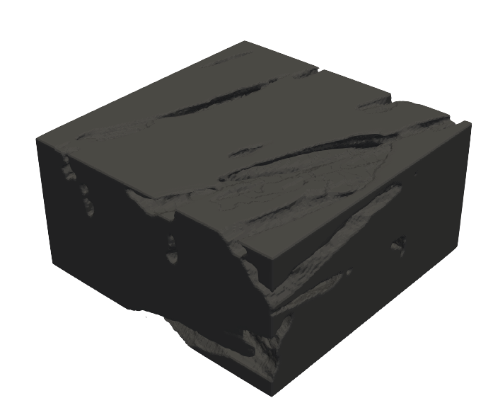
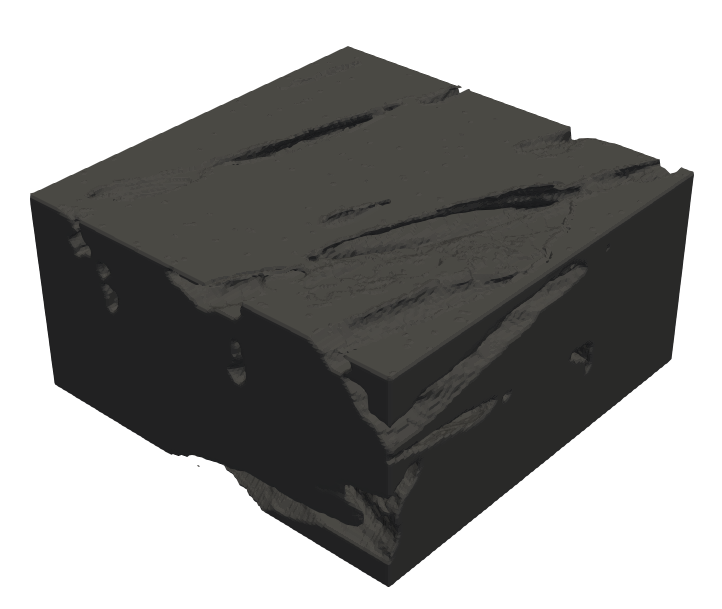

# Tutorial: Ablation of a Carbon material sample using ISTHMUS and DSMC

This tutorial guides you through the use of ISTHMUS to model the ablation of a carbon material sample when exposed to high temperature.
Gaseous interactions surrounding the material are handled by DSMC through SPARTA, while ISTHMUS recesses the material.
The recession rates computed based on DSMC are provided for you in the folder `reactionFiles`, so running DSMC is not required.

The material is a 100 $\times$ 200 $\times$ 200 micron rectangular sample, and is exposed to oxygen at 1500 K.
The oxygen is 95% monatomic O and 5% diatomic O$_2$ by mass. 



To execute the script, run the Python script produced by this tutorial document:
``` sh
python3 ablationExample.py
```

**Note:** It is recommended to run this example case using an HPC system, as the sample contains about 3.6 million voxels.
On a typical laptop or desktop machine, completion may take around 1-2 hours.

**Devs:** Note that this tutorial file `ablationExample.md` is tangled to the `.py` scripts required to run. 
To change those files, make your changes here and then tangle the markdown file by running `tangle.py`.

---

## Setup and imports

We first extend the Python path so the **ISTHMUS prototype module** can be imported, then confirm that it loads correctly.
Change the `sys.path.append` line to point to where your ISTHMUS source directory is found.

```python {file=ablationExample.py}
#!/usr/bin/env python3
#
# Add the ISTHMUS source directory and load the marching cubes library
import sys
sys.path.append('/path/to/isthmus/src/')
from isthmus_prototype import MC_System
print('ISTHMUS marching cubes module loaded')
```

---

## Import required libraries

This block loads supporting libraries for array handling, file I/O, mesh processing, and JSON output.

```python {file=ablationExample.py}
#
# Import other required modules
import os
import numpy as np
import pandas as pd
import imageio
import warnings
import json
#
# Import custom functions for this script
from utils import *
```

---

## Create working directories

We make sure folders for intermediate data exist (`grids`, `voxelData`, `voxelTri`).

```python {file=ablationExample.py}
#
# Create required directories if they don't already exist
dirs = ['grids','voxelData','voxelTri']
for d in dirs:
    os.makedirs(d,exist_ok=True)
print('Directories created')
```

---

## Define geometry parameters

This block sets the **voxel size and bounding box**, accounting for cropped boundaries.
When the sample was cropped from a larger specimen, a 5 voxel thick boundary of voxels was included which are not a part of the final result.

```python {file=ablationExample.py}
#
# Load the geometry of the sample in microns
voxelSize = 3.3757*10**-6
width = 200
height = 100
#
# Sample was cropped with a 5 voxel thick boundary of unused voxels
lo = [-5, -5, -5]
hi = [height + 5, (width + 5), (width + 5)]
lims = voxelSize*np.array([lo, hi])
nCells = np.array([int(height),int(width),int(width)])
```

---

## Set simulation constants

We define constants for the **Direct Simulation Monte Carlo (DSMC)** setup.

```python {file=ablationExample.py}
#
# Load timescale and some quantities for DSMC
timescale = 2
timestepDSMC = 7.5e-9
fnum = 14866.591116363918
avog = 6.022*10**23
```

---

## Load voxelized sample

We read a voxelized `.tif` volume and store all filled voxels as scaled coordinates.

```python {file=ablationExample.py}
#
# Load voxels from sample and rearrange from :volread: format to match ISTHMUS
fileName = 'sample.tif'
voxelMatrix = imageio.volread(fileName)
voxs = []
for i in range(int(width)):
    for j in range(int(width)):
        for k in range(int(height)):
            if voxelMatrix[k,j,i] == 1:
                voxs.append([k,j,i])
voxs = np.array(voxs)*voxelSize
print(f'{len(voxs):d} voxels loaded from sample')
```

---

## First marching windows run

The **initial surface mesh** is generated with marching cubes.

```python {file=ablationExample.py}
#
# Initial step: Generate initial mesh
step = 0
print(f'Step {step:d}/7')
#
# Run marching cubes on loaded voxels and parse volumes, faces, and vertices
resultsMC = MC_System(lims, nCells, voxelSize, voxs, 'vox2surf.surf', step, os.getcwd())
cornerVolumes, faces, vertices = parseResultsMC(resultsMC, step)
```

We use a helper function to parse the data object produced by marching cubes:

```python {file=utils.py}
#
def parseResultsMC(resultsMC,iteration):
    """
    Reads ISTHMUS marching cubes results :resultsMC: and returns volumes, faces, vertices.
    Writes an STL file 'grids/grid_:iteration:.stl'.
    """
    #
    import trimesh
    cornerVolumes = resultsMC.corner_volumes
    faces = resultsMC.faces
    vertices = resultsMC.verts
    combinedMesh = trimesh.Trimesh(vertices=vertices, faces=faces)
    combinedMesh.export('grids/grid_'+str(iteration)+'.stl', file_type='stl_ascii')
    cVolFrac = np.sum(cornerVolumes)/(nCells[0]*nCells[1]*nCells[2])
    #
    return cornerVolumes, faces, vertices
```

---

## Write initial output

Voxel coordinates are saved to file, and the **initial volume fraction** is computed.

```python {file=ablationExample.py}
#
# Write coordinate voxel data
cRemovedVox = np.zeros((len(voxs),1))
voxs = np.column_stack((voxs,cRemovedVox))
cVolFrac = np.sum(cornerVolumes)/(nCells[0]*nCells[1]*nCells[2])
#
# Write the file containing volume fraction of the material
f = open('volFrac.dat','w+')
f.write(str(cVolFrac)+'\n')
f.close()
```

---

## Ablation loop

We will use another helper function which reads triangle data from a .dat file:

```python {file=utils.py}
#
def readVoxelTri(name):
    f = open(name)
    tv_lines = f.readlines()
    f.close()
    tv_split = [tv.split() for tv in tv_lines]
    triangle_ids = []
    owned_voxels = []
    owned_sfracs = []
    c_voxels = []
    c_scalar_fracs = []
    tri_flag = 0
    for i in range(1, len(tv_split)):
        if (tv_split[i]):
            if (tv_split[i][0] == 'start'):
                triangle_ids.append(int(tv_split[i][-1]))
                c_voxels = []
                c_scalar_fracs = []
                tri_flag = 1
            elif (tv_split[i][0] == 'end'):
                owned_voxels.append(c_voxels)
                owned_sfracs.append(c_scalar_fracs)
                tri_flag = 0
            elif (tri_flag == 1):
                c_voxels.append(int(tv_split[i][0]))
                c_scalar_fracs.append(float(tv_split[i][1]))
            else:
                raise Exception("ERROR: unable to read triangle_voxels.dat")
    tri_voxs = {triangle_ids[i] : owned_voxels[i] for i in range(len(triangle_ids))}
    tri_sfracs = {triangle_ids[i] : owned_sfracs[i] for i in range(len(triangle_ids)) }

    for tv in tri_voxs.values():
        for v in range(len(tv)):
            for v2 in range(v+1, len(tv)):
                if tv[v] == tv[v2]:
                    raise Exception("ERROR: surface voxel double-assigned to a triangle")
    return tri_voxs,tri_sfracs
```

and another which reads the SPARTA surface files to generate mass fluxes based on chemical reaction:

```python {file=utils.py}
#
def readReactionSPARTA(fileName,timescale,timestepDSMC):
    """
    Reads file :fileName: in SPARTA surface format and returns the mass of CO formed at each surface triangle.
    Scales proportionally by a recession timescale :timescale: and inversely by the timestep from SPARTA :timestepDSMC:.
    """
    #
    # Initialize variables
    timeFlag = 0
    ind = 0
    COFormed = []
    #
    # Read reation file from SPARTA
    f = open(fileName,'r')
    for num, line in enumerate(f, 1):
        if 'ITEM: TIMESTEP' in line:
            timeFlag += 1
        if timeFlag == 2:
            ind += 1
        if timeFlag == 2 and ind > 9:
            s=tuple(line.split())
            COFormed.append([float(s[0]),float(s[1])*(12*10**-3)*fnum*timescale/(avog*timestepDSMC)])
    f.close()
    #
    return np.array(COFormed)
```

This loop runs **seven more ablation steps**, reading reaction data, computing carbon removal, and updating voxel/mesh state.

```python {file=ablationExample.py}
#
# Remaining steps: Ablate the material and update the grid
for step in range(1,7):
    print('Step {:d}/7', step)

    with open('volFrac.dat') as f:
        cVolFrac = f.readline().strip('\n')
    # 
    # Read voxel data 
    with open('voxelData/voxelData_'+str(step-1)+'.dat') as f: 
        lines = (line for line in f if not line.startswith('#')) 
        voxsTemp = np.loadtxt(lines, delimiter=',', skiprows=0) 
    # 
    # Associate voxels to tirangles
    tri_voxs,tri_sfracs = readVoxelTri('voxelTri/triangle_voxels_'+str(step-1)+'.dat')
    # 
    # Read surface reactions
    COFormed = readReactionSPARTA('reactionFiles/surf_react_sparta_'+str(step)+'.out',timescale,timestepDSMC)
    COFormed = COFormed[COFormed[:, 0].argsort()]
    # 
    # Calculate mass of carbon associated with each voxel
    volFracC = float(cVolFrac)
    volC = volFracC*((voxelSize)**3)*(lims[1,0]-lims[0,0])*(lims[1,1]-lims[0,1])*(lims[1,2]-lims[0,2])
    massC = volC*1800
    massCVox = massC/len(voxsTemp)
    # 
    # Calculate the mass of carbon removed from each voxel
    cRemovedVox = np.zeros((len(voxsTemp)))
    for i in range(len(COFormed)):
        vox_no = np.array((tri_voxs[(i+1)]),dtype = int)
        sfracs = np.array((tri_sfracs[(i+1)]),dtype = float)
        for k in range(len(vox_no)):
            cRemovedVox[vox_no[k]] = cRemovedVox[vox_no[k]] + sfracs[k] * COFormed[i,1]
    cRemovedVox[:] = cRemovedVox[:] + voxsTemp[:,3]
    # 
    # Remove voxels
    voxsTemp = np.column_stack((voxsTemp[:,0:3],cRemovedVox))
    for i in range(len(cRemovedVox)):
        if cRemovedVox[i] > massCVox:
            voxsTemp[i,:] = 0
    voxsTemp = voxsTemp[~np.all(voxsTemp == 0, axis=1)]
    voxs_isthmus = voxsTemp[:,0:3]
    # 
    # Create triangle mesh, assign voxels to triangles and save mesh
    resultsMC = MC_System(lims*voxelSize, nCells, voxelSize, voxs_isthmus, 'vox2surf.surf', step, os.getcwd(), weight=True, ndims=3)
    cornerVolumes, faces, vertices = parseResultsMC(resultsMC, step)
    #
    # Write coordinate voxel data
    writeCoordinateVoxelData(voxsTemp)
    #
    # Write the file containing volume fraction of the material
    cVolFrac = np.sum(cornerVolumes)/(nCells[0]*nCells[1]*nCells[2])
    f = open('volFrac.dat','w+')
    f.write(str(cVolFrac)+'\n')
    f.close()
    print(f'{len(voxsTemp):d} voxels remaining')
    #
    with open('voxelData/types'+str(step)+'.dat', 'w+') as file:
        json.dump(voxs_types, file, indent=4)
```

---

## Completion

At the end, intermediate files are removed and the run finishes.

```python {file=ablationExample.py}
#
# Remove temporary files
os.remove('voxelData')
os.remove('voxelTri')
os.remove('volFrac.dat')
print('Temporary directories removed')
print('Done!')
```

Before ablation:


After ablation:


---

