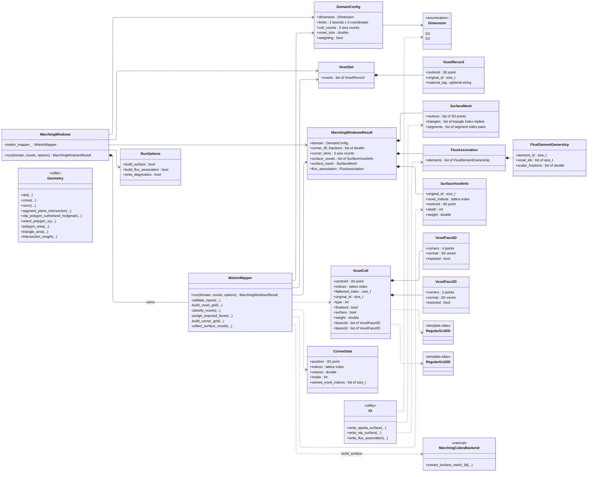

# Native C++ UML Diagram

This diagram reflects the current native C++ implementation at the repository root.
It focuses on the public entry point, the internal motion-mapping pipeline,
the grid/result model, and the geometry and IO helpers that support the native
backend.

The diagram intentionally treats `isthmus::geometry`, `isthmus::io`, and
`isthmus::marching_cubes` as module-level utility areas rather than class
hierarchies. The native code is still centered on `MarchingWindows`, which
delegates to `MotionMapper` and optionally fills `surface_mesh` when the
surface backend is requested.

## Legend

- `A --> B`: Association. A has a named or direct relationship to B.
- `A *-- B`: Composition. A owns B as part of its data; B usually lives and dies with A.
- `A o-- B`: Aggregation. A has B, but B can exist independently of A.
- `A ..> B`: Dependency. A depends on B in a lighter, non-owning way, such as calling a helper or using a type temporarily.
- `A <|-- B`: Inheritance. B is a specialized kind of A.
- `A <|.. B`: Realization. B implements an interface or abstract contract from A.
- `A -- B`: Simple association line with no arrow direction shown.
- `+member`: Public field or method that callers can use.
- `-member`: Private field or method used only inside the class.
- `<<enumeration>>`: A fixed set of named values, like `Dimension::D2` and `Dimension::D3`.
- `<<utility>>`: A helper namespace or module with functions rather than a normal object with state.
- `<<internal>>`: A type that is part of the implementation but not intended as the main public API.
